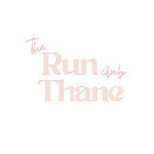

# 🏁 The Run Club Thane (TRCT)

> **Not A Club, A CULT.**

Join Thane's most electrifying running community. Every Sunday. Gen Z energy. Pure cult vibes.



## ⚡ Overview

TRCT is the digital home for Thane's biggest running movement. This project is a modern, high-performance web application built to showcase our events, gallery, and community spirit.

### 📍 When & Where
- **Every Sunday**
- **7:00 AM**
- **Thane, Maharashtra**

---

## 🛠️ Tech Stack

- **Framework:** [Next.js 15+](https://nextjs.org/) (App Router)
- **Styling:** [Tailwind CSS](https://tailwindcss.com/)
- **Animations:** [Framer Motion](https://www.framer.com/motion/)
- **UI Components:** [Radix UI](https://www.radix-ui.com/) & [Shadcn UI](https://ui.shadcn.com/)
- **Icons:** [Lucide React](https://lucide.dev/)
- **Analytics:** [Vercel Analytics](https://vercel.com/analytics)
- **Runtime:** [Bun](https://bun.sh/) / Node.js

---

## 🚀 Getting Started

### Prerequisites

Ensure you have [Bun](https://bun.sh/) (recommended) or [Node.js](https://nodejs.org/) installed.

### Installation

1. Clone the repository:
   ```bash
   git clone https://github.com/rithvikshettyy/trct.in.git
   cd trct
   ```

2. Install dependencies:
   ```bash
   bun install
   # or
   npm install
   ```

3. Run the development server:
   ```bash
   bun dev
   # or
   npm run dev
   ```

4. Open [http://localhost:3000](http://localhost:3000) in your browser.

---

## 📦 Project Structure

```text
├── app/              # Next.js App Router (Pages, Layouts)
├── components/       # Reusable React components
├── hooks/            # Custom React hooks
├── lib/              # Utility functions and shared logic
├── public/           # Static assets (images, fonts, icons)
└── styles/           # Global CSS and Tailwind configurations
```

---

## ✨ Features

- **Bold Hero Section:** High-energy visuals reflecting the community spirit.
- **Dynamic Marquees:** Real-time event info and slogans.
- **Vault:** Private gallery and community content.
- **Responsive Branding:** Built with a raw, brutalist aesthetic.

---

## 🤝 Community & Support

TRCT is more than just a running club. We are a community.

- **Founder:** [Rithvik Shetty](https://github.com/rithvikshettyy)
- **Website:** [trct.in](https://trct.in)

---

## 📄 License

This project is private and intended for the TRCT community.

---

*Built with ❤️ by the TRCT Tech Team.*
